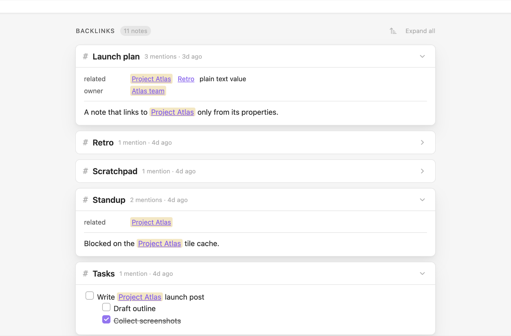
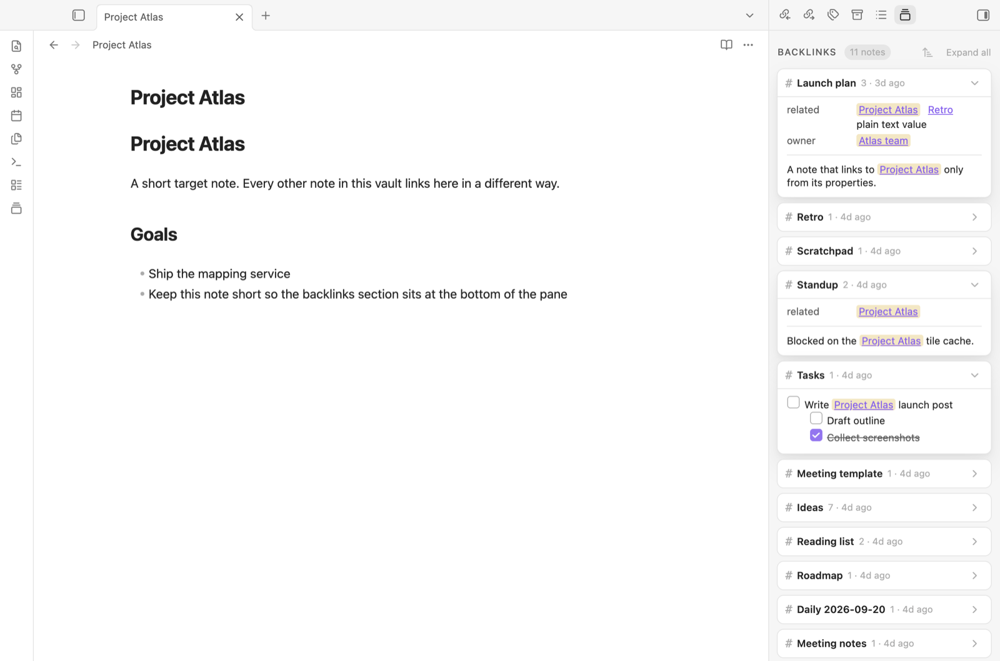

# Better Backlinks

Better Backlinks shows each note's backlinks as cards, at the bottom of the note, in a sidebar, or both. Each note that links to the current note gets a card, and each card shows the **whole block** around the link as rendered markdown, not a one-line search hit.



It also finds notes that are related without linking: notes whose title contains this note's name, and notes that mention its name as plain text, with a button to turn each mention into a link. Daily and weekly notes can list the notes created on their day or during their week.

## What it shows

### Backlinks

One card per linking note, however many times it links here. The card shows the block the link sits in:

- A link in a **heading** shows that heading's whole section.
- A link in a **list item** shows the item and everything nested under it. When the item is nested, its parent items appear above it, dimmed, for context.
- A link in a **paragraph**, **table**, **blockquote** or **callout** shows that block.
- A link in a **property**, such as `related: "[[Project Phoenix]]"`, appears as a row at the top of the card, showing the property's name and all its values.
- If several links fall in the same block, or one block contains another, they appear once, with every link highlighted.

Each card shows how many times the note links here and when it was last modified. Links in code blocks and embeds (`![[...]]`) don't count as backlinks.

### Title matches

Notes whose **title contains this note's name** also appear, even if they never link to it. For example, `2026-09-24 Meeting with Joe` appears under the daily note `2026-09-24`. These cards show just the title, with the matching part highlighted.

The name must appear as a whole word, in any case, so a note called `Joe` matches `Meeting with Joe` but not `Joel's plan`. Titles identical to the note's name don't count, and neither do one-character names. If a note also links here, it gets a normal backlink card instead.

### Unlinked mentions

An **Unlinked mentions** group lists notes that write this note's name as plain text without linking it. For example, "Planning to do x on 2026-09-24 in the evening" appears under the daily note `2026-09-24`. Each card shows the block around the mention, with the text marked by a dashed underline. The cards start collapsed.

- **Link** after a mention turns that text into a link: `2026-09-24` becomes `[[2026-09-24]]`. Text cased differently from the note's name keeps its wording as the link's display text, so `project atlas` becomes `[[Project Atlas|project atlas]]`. Links follow your vault's link settings (wikilinks or Markdown links, and the path format).
- **Link all** on a card links every mention in that note.
- **Click the marked text** to jump to it in the source note.

Once a note is linked, its card moves up into the backlinks. Mentions are matched like titles (whole words, any case), and text inside existing links, tags, properties, code, URLs, `%% comments %%` and math is ignored. Finding mentions means reading every note, so in a large vault this group fills in over a second or so after the note opens. The backlinks above it appear straight away.

### Notes created on this day or this week

Daily and weekly notes can list the notes created during their day or week, in a **Created on this day** or **Created this week** group. Both are off by default; turn them on under **Daily notes** and **Weekly notes** in the settings.

Each card shows when the note was created (the time, and on a weekly note the weekday too) and previews how the note starts. Like every group, they follow the sort order; choose **Created (oldest first)** to read the day or week in the order it was written.

- **Recognizing daily notes:** by default the plugin uses the date format and folder from Obsidian's Daily notes settings. If you use another plugin for daily notes, set **Date format** and **Folder** under **Daily notes**.
- **Recognizing weekly notes:** Obsidian has no built-in weekly notes. If the Periodic Notes plugin is on with weekly notes turned on, its format and folder are used. Otherwise weekly notes are named by ISO week, such as `2026-W40`, in any folder. Either way you can set **Week format** and **Folder** under **Weekly notes**. ISO tokens (`GGGG`, `WW`) give Monday-to-Sunday weeks; locale tokens (`gggg`, `ww`) follow your locale's first day of the week.
- **Creation dates:** a note's creation date comes from its `created` property (for example `created: 2026-09-24` or `created: 2026-09-24T09:42`) when it has one, and from the file otherwise. File dates can change when notes are synced, copied or restored; a property doesn't. You can change which property is used under **Creation dates**.

### One list or groups

By default, backlinks, notes created on the day or week, and unlinked mentions appear in separate groups. Turn on **Show everything in one list** to see them together in a single list, in the note's sort order, without group headings. A note that would appear in several groups gets one card that combines them, for example "1 mention · 1 unlinked · created 9:42 AM", with its excerpts and **Link** buttons together.

## Where it shows

### At the bottom of notes

The Backlinks section sits under the note in Live Preview, Source mode and Reading view, and scrolls with it. On a short note it sits at the bottom of the pane like a footer. It's hidden when a note has nothing to show. Turn it off with **Show backlinks section** in the settings or the **Toggle backlinks section** command, or leave it out of Reading view with **Show in Reading view**.

Obsidian's core Backlinks plugin can also list backlinks at the bottom of notes, which would give you two lists. To turn that off, go to **Settings → Core plugins → Backlinks** and switch off **Show backlinks at the bottom of notes**. The core Backlinks pane in the sidebar isn't affected.

### In the sidebar

Everything is also available in a sidebar, like Obsidian's own Backlinks pane. Open it with **Better Backlinks: Open sidebar** from the command palette, or with the ribbon icon (a stack of cards). It opens in the right sidebar, and you can drag it anywhere.



The sidebar shows the note you're working in and follows you as you switch notes. It works with the bottom section on or off, so you can use either or both. Collapsed cards and sort order are shared between the two.

### On mobile

Better Backlinks works on phones and tablets. On mobile, and in the sidebar, cards are more compact so titles have room: titles are a little smaller, and the card's details drop their words ("1 · 3h ago" instead of "1 mention · 3h ago").

Everything takes its colours and fonts from your theme, in light and dark mode.

## Using it

- **Click a card's title** to open that note. Cmd/Ctrl-click opens it in a new tab.
- **Click a highlighted link** to jump to that exact spot in the source note. The link is selected and briefly flashes so you can find it.
- **Click a highlighted property link** to open the source note with that property flashing.
- **Tick a checkbox** in an excerpt to update the task in the source note. Apart from **Link** on unlinked mentions, this is the only change the plugin makes to your notes.
- **Click a card's header** to collapse or expand it, or use **Collapse all / Expand all** in the Backlinks header for every card in the note: backlinks, notes created that day or week, and unlinked mentions. Each card remembers its state for the note you're viewing.
- **Hover a title or link** while holding Cmd/Ctrl to see a Page Preview popover. You can change whether the modifier is needed under **Settings → Core plugins → Page preview → Better Backlinks**.

### Sorting

Cards are sorted by modified date, newest first, unless you choose otherwise. The sort button in the Backlinks header offers name (A to Z or Z to A), modified date and created date (newest or oldest first). The order applies to every group (backlinks, notes created on the day or week, and unlinked mentions) and to the whole list when everything is shown in one list. Blocks inside a card stay in the order they appear in the note.

The order you pick is saved for the note you're viewing. Other notes keep the default, which you can change in the settings. To make a note follow the default again, choose **Use default** in its sort menu. When sorting by created date, cards show when each note was created instead of when it was modified. Created dates come from a note's `created` property when it has one, and from the file otherwise.

## Installing

**From Obsidian:** open **Settings → Community plugins → Browse**, search for **Better Backlinks**, then install and enable it.

**By hand:** download `main.js`, `manifest.json` and `styles.css` from the [latest release](https://github.com/MrVersano/obsidian-better-backlinks/releases/latest) into `<your vault>/.obsidian/plugins/better-backlinks/`, then enable **Better Backlinks** under **Settings → Community plugins**.

Better Backlinks works on desktop and mobile and needs Obsidian 1.7.2 or later.

## Settings

| Setting | Default | |
| --- | --- | --- |
| Show backlinks section | On | Shows the section at the bottom of notes. The sidebar works either way. Also available as the **Toggle backlinks section** command, which has no hotkey unless you assign one. |
| Default sort order | Modified (newest first) | Used by every note that hasn't been given its own order from the sort menu. |
| Expand cards by default up to | 4 | Notes with more cards than this start with them collapsed. |
| Mentions shown per card | 3 | Further blocks sit behind "+N more mentions". The property row doesn't count toward this. |
| Highlight matches | On | Highlights links to this note in excerpts and properties, and the matching part of title-match titles. When off, they look like ordinary links and text but still jump to the mention when clicked. |
| Show in Reading view | On | Shows the bottom section in Reading view too. |
| Include links in properties | On | Counts links in a note's properties as backlinks. Turn it off to count links in the note body only. |
| Include title matches | On | Shows notes whose title contains this note's name, even without a link. |
| Show unlinked mentions | On | Lists notes that mention this note's name as plain text, with buttons to link them. |
| Show everything in one list | Off | Combines backlinks, notes created on the day or week, and unlinked mentions into one list, with one card per note. |
| Excluded folders | None | Notes in these folders never appear, for example `Templates`. One folder per line. |

**Creation dates**

| Setting | Default | |
| --- | --- | --- |
| Created date property | `created` | The property that holds a note's creation date, used by the daily and weekly notes groups. |

**Daily notes**

| Setting | Default | |
| --- | --- | --- |
| Show notes created on this day | Off | Adds the **Created on this day** group to daily notes. |
| Date format | Obsidian's Daily notes format | How daily notes are named, as a [Moment.js format](https://momentjs.com/docs/#/displaying/format/). |
| Folder | Obsidian's Daily notes folder | Where daily notes are kept. |

**Weekly notes**

| Setting | Default | |
| --- | --- | --- |
| Show notes created this week | Off | Adds the **Created this week** group to weekly notes. |
| Week format | Periodic Notes' format, else `GGGG-[W]WW` | How weekly notes are named, as a [Moment.js format](https://momentjs.com/docs/#/displaying/format/). |
| Folder | Periodic Notes' folder, else anywhere | Where weekly notes are kept. |

## Privacy

Better Backlinks works entirely inside your vault and makes no network requests.

- **Backlinks** come from Obsidian's own link index, plus the text of each linking note, read to show its excerpt.
- **Title matches** and **notes created on a day or week** go through the list of your notes, using their names, properties and file dates.
- **Unlinked mentions** read your notes' text to find this note's name written without a link.

Only those last three go through your whole vault, and only while they're turned on. With **Include title matches** and **Show unlinked mentions** off (and the daily and weekly groups left off), the plugin reads only the notes that link to the one you're viewing. Nothing is stored outside the plugin's own settings file.

## Development

```sh
npm install
npm run dev     # rebuild on change
npm run build   # type-check and production build
npm run lint    # ESLint with Obsidian's plugin review rules
```

To try a build, copy `main.js`, `manifest.json` and `styles.css` into a vault's `.obsidian/plugins/better-backlinks/` folder, or symlink this folder there. If a vault named `test-vault` sits in this folder, each build is copied into it automatically.

- [src/main.ts](src/main.ts) is the plugin entry: events, commands, the sidebar view and saved state.
- [src/panel.ts](src/panel.ts) builds the groups and cards for one note. Both places that show them host a panel: [src/view.ts](src/view.ts) at the bottom of a note, and [src/sidebar.ts](src/sidebar.ts) in the sidebar.
- [src/backlink-index.ts](src/backlink-index.ts) finds backlinks, title matches, unlinked mentions and notes created in a period, using Obsidian's metadata cache.
- [src/excerpt.ts](src/excerpt.ts) decides which block to show for each link. [src/unlinked.ts](src/unlinked.ts), [src/title-match.ts](src/title-match.ts), [src/periodic-notes.ts](src/periodic-notes.ts), [src/properties.ts](src/properties.ts) and [src/sort.ts](src/sort.ts) hold the other rules. None of these use the DOM, so they can be unit-tested.
- [src/settings-tab.ts](src/settings-tab.ts) declares the settings, so they appear in Obsidian's settings search.

### Releasing

1. Run `npm version patch` (or `minor` / `major`). This updates `manifest.json`, `package.json` and `versions.json`, commits, and tags the new version without a `v`, as Obsidian requires.
2. Run `git push --follow-tags`. Push one tag at a time: GitHub skips workflows when more than three tags arrive in one push.
3. The Release workflow builds the plugin and publishes a GitHub release for the tag with `main.js`, `manifest.json` and `styles.css`.

## License

[MIT](LICENSE)
